# Oakwood Cove Camp Site  

Oakwood Cove Campsite is a website to promote a newley developed camp site for motorhomes, caravans and tents. Visitors to the site will also be able to submit a message to the owners of the site using the contact form.  

The site is built using HTML5, CSS3 and Bootstrap v5 for the Milestone Project 1 for Code Institute's Diploma in Web Development.

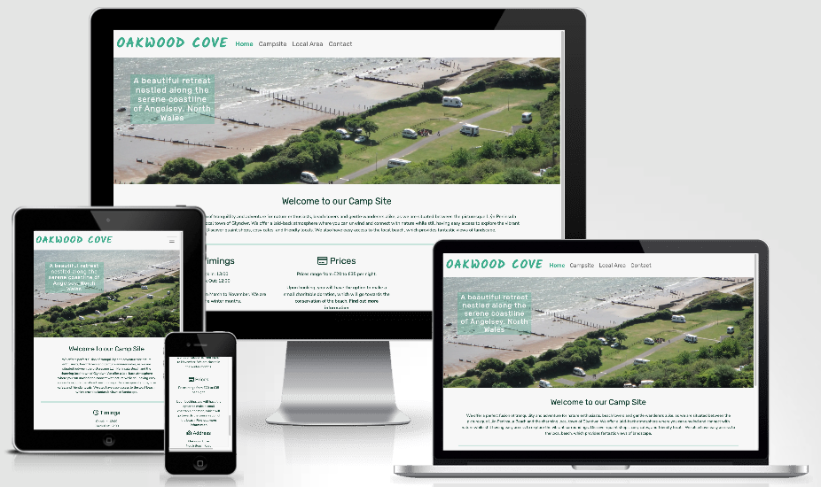

[Live Website](https://k-coll.github.io/mp1-oakwood-cove-campsite/)

## Table of Contents

## User Experience (UX)
### Strategy
The Oakwood Cove Camp Site Website is designed to be responsive and accessible on a range of devices. It allows visitors to find out about the campsite, the local area in which it is situated, what facilities and amenities there are and the types of pitches available to book.

### User Stories and Project Goals  
  * #### Client Goals
    a.  To showcase the newly developed camp site including the grounds, pitches and all the facilities on offer to visitors and potential customers.   
    b.  To allow visitors to the site to contact the camp site owners for any potential enquires or to book a holiday.  
    c.  To be able to view and use the site on multiple devices.

  * #### First Time Visitor Goals
    a.  I want to be able to understand the purpose of the site.    
    b.  I want to see pictures of the camp site pitches.  
    c.  I want to know what facilities are available and what the camp site offers.  
    d.  I want to get in touch and to have any potential questions answered.  
    e.  I want to be able to navigate the site easily to find information.    
  
  * #### Returning Visitor Goals
    a. I want to view the pictures of the camp site for my upcoming holiday.  
    b. I want to access useful information and review the facilities on offer while planning for an upcoming holiday at the campsite.  
    c. I want to follow up on my previous viewing of the website in order to make an enquiry and get in touch with the camp owners.  
  
  * #### Frequent Visitor Goals
    a. I want to recommend Oakwood Cove Camp Site to my friends and family for their camping holidays.  
    b. I want to check out new features as the website develops.
  
### Scope
  The goal for the project is to make an informative, easy to navigate and visually appealing website, with a minimym of three pages.  

### Structure
  Overall the website has four pages. These are:  

*  **The Home Page**  
    This page is the landing page of the website to introduce the camp site.

* **Campsite**  
    This page is to showcase and promote what’s on offer and provided by the campsite, to enable visitors and potential customers to plan for their holiday.  

* **Local Area**  
    This page is to promote the local area and showcase what visitors can expect to take part in when they book a holiday at the campsite.  

* **Contact**  
    This pages is to provide users with additional information that is asked frequently and to provide an option for users to contact the owners of the campsite regarding a general enquiry or to book specific dates.  

    Social Media icons are also shown in the footer of each page, along with a direct link to the contact page.
  
### Skeleton

  Wireframes were created for this project using Balsamic. For each page, a wireframe was created for mobile, tablet and desktop. I tried to stick to this design as close as possible for the final project.

Home

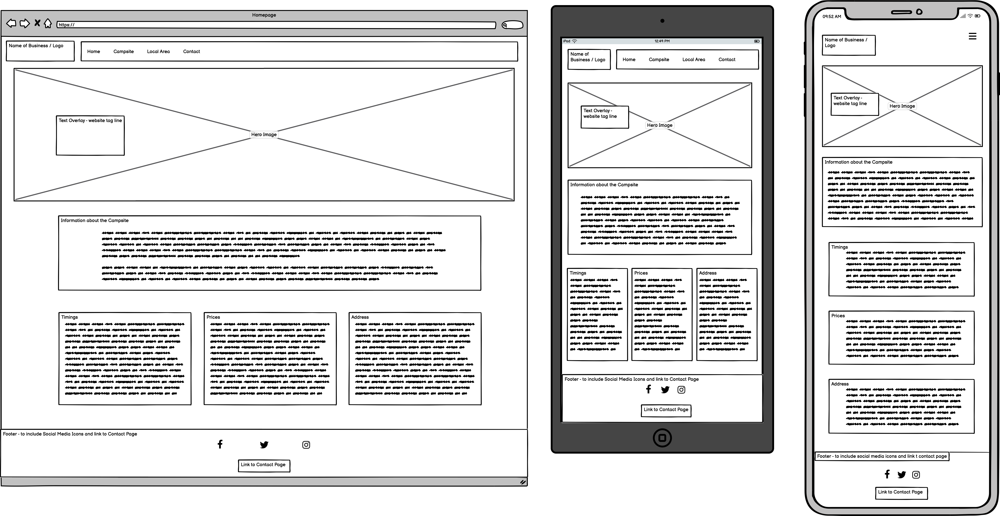

Campsite

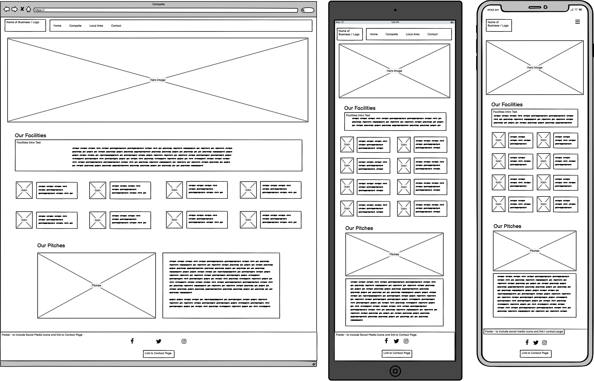

Local Area

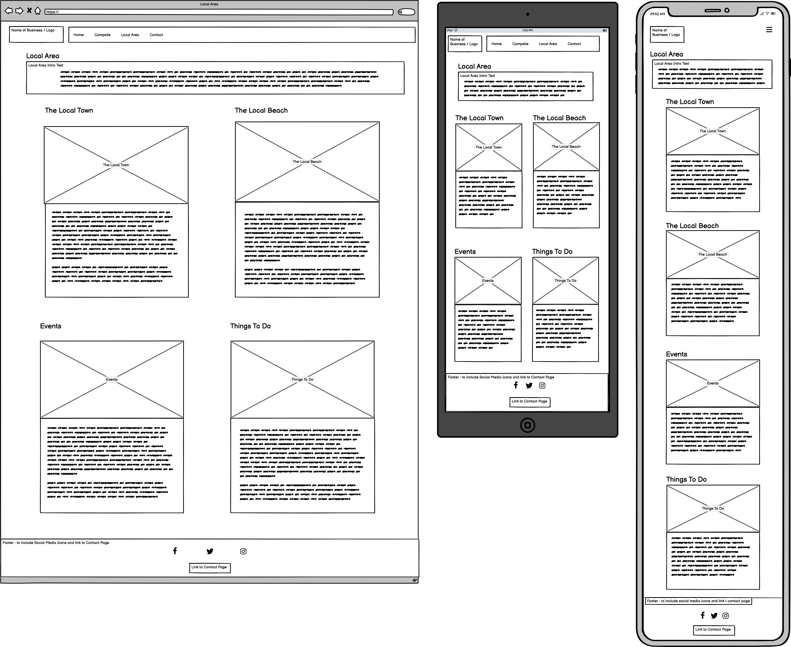

Contact

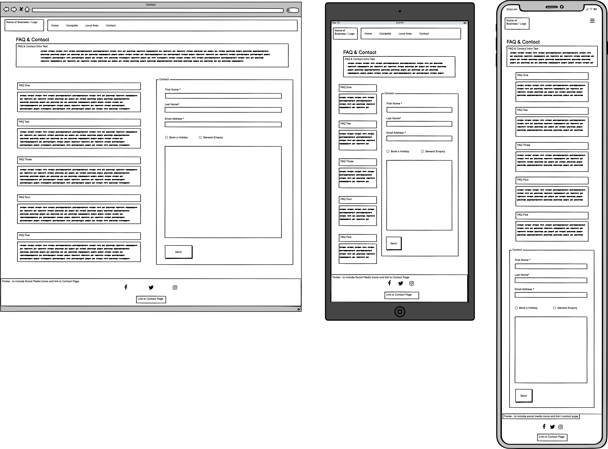

  ### Surface

* #### Design
    There was an iterative design process of the website, which was improved upon by adding in a < hr > tag to visually separate different sections. This also incorporates the brand and the theme and creates a more cohesive look to the overall website.
    *  The < hr > tag was added after the navigation bar (on the local area and contact pages and covered 100% of the page width)  
    *  The < hr > tag was also added after the about us section on the main homepage, and after the frequently asked questions section (only on small devices). This covered 90% of the page width, with spacing either side, to create a light, airy and breathable divide between sections.

* #### Colour Scheme
    The idea for the colour scheme is to keep it fresh and bright, whilst also being easy to read and understand. I also wanted to tie the colour scheme into the grounding colours of nature to create a calming outside holistic feel, which the hues green provides.  

    The overall design of the website is minimalistic; only three colours are used. This is purposeful so as not to take away focus on the images used within the website and also not the clash with them. The images used have lots of complimentary colours which creates an overall cohesive and pleasing aesthetic.  

    The design of the website to include the colour scheme is to create a gradient effect. The top of the website is lighter, the main body of the website is a mix of light and dark to create contrast, and the bottom of the website is darker.  

    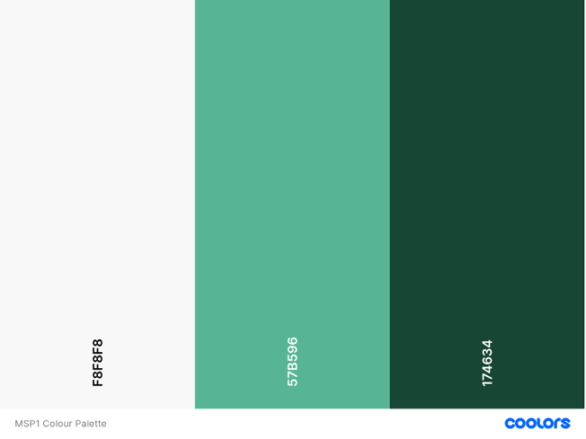

* #### Contrast Checker
    Contrast was checked for accessibility using WebAIM's contrast checker - https://webaim.org/resources/contrastchecker/. The contrast for the main body of the website is 10.07:1.

    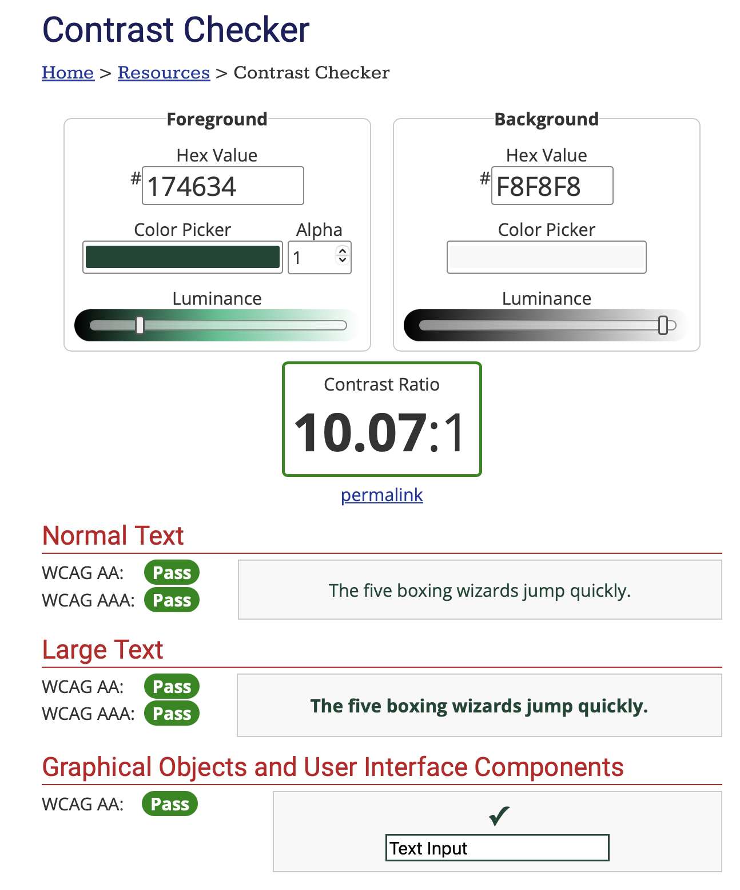

* #### Typography
    Three fonts are used for this website.  
    
    Kalam is used for the website title / logo, for the contact link within the footer and for the submit button. Rubik is used for the menu navigation bar and the headings. Nunito Sans is used for the main body of the website.  
    
    Sans Serif was also used as the fall-back font throughout the entire website, if the other fonts are not working properly.  
    
    These fonts are accessible and were chosen because they are clear and easy to read and are popular for people who have visual or cognitive disabilities.  
    
* ### Imagery and Media 
  * #### Imagery
    The imagery captures a sense of being outdoors and features a lot of the grounding colours of nature, which complement the colours used for the design to tie everything together and give it an overall cohesive look.  
    
    The type of imagery used on the website is sourced from Freepik.com, specifically:  
            * [Home Page Hero Image](https://www.freepik.com/premium-photo/high-angle-view-trees-beach_114914176.htm). From author [EyeEm](https://www.freepik.com/author/EyeEm)  
            * [Campsite Page Hero Image](https://www.freepik.com/free-photo/toddler-brother-sister-autumn-playground_2784350.htm). From author [Freepik](https://www.freepik.com/author/freepik)  
            * [Campsite Page Pitches section](https://www.freepik.com/premium-photo/caravan-camping-site-nature-with-travel-trailers-riva-istanbul-turkey-april-04-2022_31832656.htm) from author [Gizemg](https://www.freepik.com/author/gizemg)  
            * [Local Area Page, Glyndwr Town card](https://www.freepik.com/premium-photo/prague-czech-republic-september-22-2018-charles-bridge-sunrise_26236017.htm). From author [EugenePetrunin](https://www.freepik.com/author/eugenepetrunin)  
            * [Local Area Page, Llŷn Peninsula Beach card](https://www.freepik.com/free-photo/walking-area-front-waikawa-beach-new-zealand_11111961.htm). From author [Wirestock](https://www.freepik.com/author/wirestock)  
            * [Local Area Page, Events card](https://www.freepik.com/premium-photo/blur-festival_5387185.htm). From author [user7814140](https://www.freepik.com/author/user7814140)  
            * [Local Area Page, Things To Do card](https://www.freepik.com/free-photo/low-angle-shot-st-george-s-chapel-middle-park-windsor-uk_10990346.htm). From author [Wirestock](https://www.freepik.com/author/wirestock)    

  * #### Media
    Font Awesome icons are also used sparingly throughout.  

    The icons are used within the footer on each page to provide a visual representation of the social media links.  

    The icons are also used on the Campsite page, specifically in the Facilities section to again provide a visual representation of the different facilities and amenities that are provided by the campsite. This also differentiates between the Facilities and Pitches sections breaks up the text, so it’s not two big paragraphs of listed text.

## Features
The website consists of four pages and 16 elements / features overall.

### Site Level Elements
* There is a header at the top of the page which is comprised of the Bootstrap Nav Bar. This houses the name of the camp site and links to all the pages contained within the website to act as a navigational menu bar. It is fully responsive and collapses down to a hamburger menu on medium and small devices. There is a balanced design to this, as the menu text is horizontally centred and in line with the middle of the logo / name of the website.  
* There is a footer at the bottom of every page which houses the social media icons and an internal link that takes user directly to the contact page. The social media links for Facebook, Twitter / X and Instagram, show as icons. These are active links but they navigate to the homepages of Facebook, Twitter / X and Instagram respectively and do not link to the actual campsite, as it is a fictional business for project purposes.  
* The name of the campsite appears in the browser tab for each of the pages.

### Page Level Elements

* #### Homepage 
    The home page is the landing page of the website and features a hero image, which is an aerial image of the camp site to show that is by the beach, underneath the navigational header. There is also a text overlay that houses the tag line for the campsite. The background image is used as decoration and is therefore added in via CSS.  
    
    There is some welcome text underneath this which introduces the camp site. Furthermore, there is a general section set out in three columns, which provides additional information such as the opening times, the prices and the address.

* #### Campsite
    This page is split into three sections – the hero image to showcase that the campsite is child and family friendly, the facilities section and the pitches section.  
    
    The Facilities section utilises the Bootstrap grid and is fully responsive. On large devices, the content is displayed across four columns, whereas on medium and smaller devices, the content is displayed across two columns.  Font Awesome icons were used to help visualise the facilities and amenities that are available in the campsite – such as security, the toilet / shower block, wifi, a shop, etc.  
    
    The pitches section is split in two – one the left-hand side there is an image of some campervans on the pitches and on the right-hand side there is an ordered list of the pitch types that are available, along with any additional charges. This is also fully responsive. On a large and medium device, the image and listed text appear side by side. On a small device, they are stacked on top of each other, with the image appearing first and the listed text appearing underneath.  
    
* #### Local Area
    This page utilities the Bootstrap card element and has 4 images, with accompanying text underneath. The information is broken down into four sub headings - Glyndwr Town, Llŷn Peninsula Beach, Events and Things to Do. The aim of this page is to showcase the local area in which the camp site is located, enabling visitors and potential customers to plan their holiday with activities and things to do and enjoy. The purpose of this is to reinforce a sense of community and connection between the campsite, it’s owners and the local area. Again, this page is also fully responsive. On a large and medium device, the four cards are displayed in two columns and two rows. On a small device, the four cards are displayed in one column with four rows, as they are all stacked on top of each other.  

* #### Contact
    This page has an introductory section at the top and is then split into two columns of equal width. One the left is the FAQ section comprised of a Bootstrap accordion that is styled with custom CSS. On the right is the contact form.  
    
    This page has two purposes – one to provide customers with useful information that is often asked, and two to provide an option for users of the website to contact the owners of the campsite. This could be to provide feedback, for a general enquiry or to book a holiday for specific dates. Some elements are mandatory and are required before the form can be submitted properly.  
    
    This page is also fully responsive. On a large and medium device, the FAQ section is on the left-hand side and the Contact Form is on the right hand side. Whereas on a small device, the sections are stacked on top of each other. There is also a horizontal rule in between the two sections when on a small device, to differentiate between the two and to tie in the branding and the theme to create an overall cohesive look.  

## Future Implementations
* Addition of an iframe to incorporate the google maps into the address section
* An information page providing advice and guidance for how to camp responsibly and resourcefully.
* Develop the contact form into a fully functioning booking form. This would have a calendar integrated in so customers can see what dates are available and what dates have already been booked / are fully booked. Customers will be able to choose how many nights they want to book, what pitch type they want to book and where in the campsite they want to be located (by the toilet block, by the entrance, by the beach, don’t mind, etc).
* Create a Photo Gallery to house images of the camp site, the pitches, the facilities and the local area with activities and things to do. This would be used as a showcase so visitors and potential customers can view the campsite in more detail.

## Accessibility
I have tried to ensure the website is as accessible as possible by:
* Using semantic HTML.
* Using descriptive alt attributes for images throughout the website.
* Using easy to read and accessible fonts.
* Adding aria-labels for screen readers.
* Using a cohesive design scheme and colour contrasts to make sure the text is easy to read.
* Using clear navigation.

## Solved Bugs
1.	Nav Bar Section  
On the “Local Area” and “Contact” page, there was no clear distinction between the Nav Bar and the Main Body. To fix this, there was an iterative design process of the website, which was improved upon by adding in a < hr > tag to cover the whole width of the page. This was not added to the “Home” page and the “Campsite” page, as the hero image acts as the section break after the Nav Bar and before the main body text. Therefore, it was deemed unnecessary. This also incorporates the brand and the theme and creates a more cohesive look.  

2.	Footer  
At first, the social media icons were too close together. This caused an issue particularly on small devices, as it was difficult to distinguish which link you wanted to click on. This was fixed by increasing the size of the icons and adding padding to create more space between the < a > links.  

3.	Campsite page – Facilities section  
At first the columns for the facilities section were too close together making the text look squashed together. This made the section itself quite short in comparison to the hero image and the pitches section. This was fixed by adding padding to the top and bottom to the bootstrap columns to create more space in-between the font awesome icons. Furthermore, the overall vertical alignment of this section of the page is now more balanced as it is taller than before.  

4.	Main Page - General Info Section  
On a mobile device there was not enough room between the general info sections, in particular between the middle section in relation to the top and bottom sections. This was fixed by increasing the margins with the bootstrap classes to add spacing in between the columns, when on a small device in a stacked view.  

5.	Local Area - Cards  
Both the “Glyndwr Town” and “Events” cards were the same height and the “Llŷn Peninsula Beach” and “Things To Do” cards were the same height. However, all four cards were not the same height as each other due to the differing amount of text. To fix this, the Bootstrap class of ‘h-100’ was added to each individual card, to make the height equal and all the same.  

6.	Contact Us – Main Body  
I wanted to add a < hr > tag between the FAQ and Contact sections on a small device, as when they were stacked on top of each other, there was no clear distinction between the two sections. However, when adding the < hr > it worked for the small device, but it pushed the Bootstrap grid columns out of alignment on the medium and large devices. This was solved by using a media query to hide this < hr > tag from view on medium and large devices, and to only have it visible on small devices where the sections are stacked on top of each other. A border was not added to the Bootstrap columns themselves, as this wasn’t necessary to distinguish between the sections for the medium and large devices.  

## Testing

Chrome developer tools were used to test, identify and address any issues. This was also used to ensure the website was responsive on different screen sizes throughout the build process.

### Validator Testing
* #### HTML Validation
    The W3C HTML Markup Validator was used to validate the HTML code of the website. All HTML validation was successful, with no errors showing. However, for the homepage, campsite and local area pages there were warnings. This was due to the use of the headings being out of order. This was a learning I took away from this project and from web desing and development overall. With additional time, I would have re-ordered the headings and I plan to do this as part of the future development of this website.

    

Home

    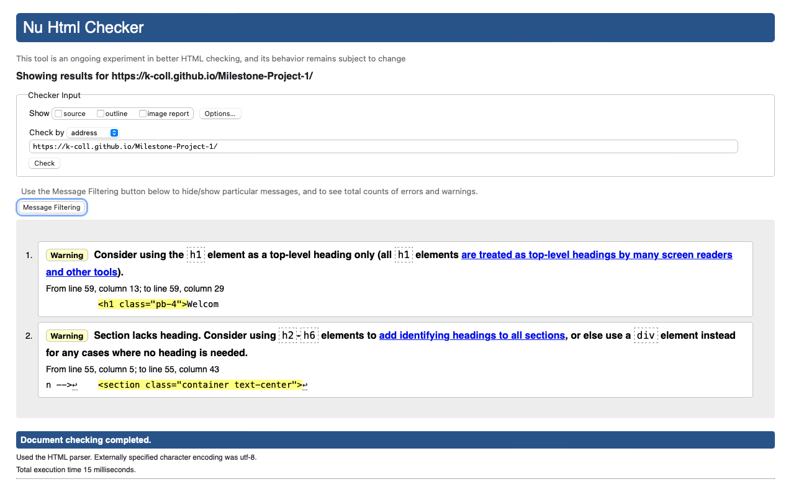
    

    

Campsite

    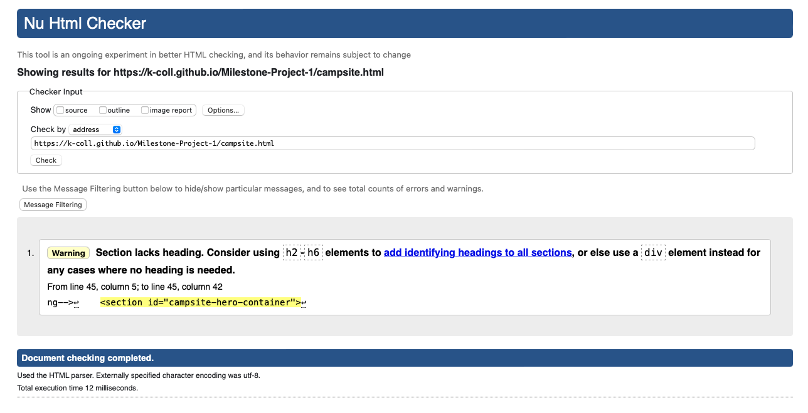
    

    

Local Area

    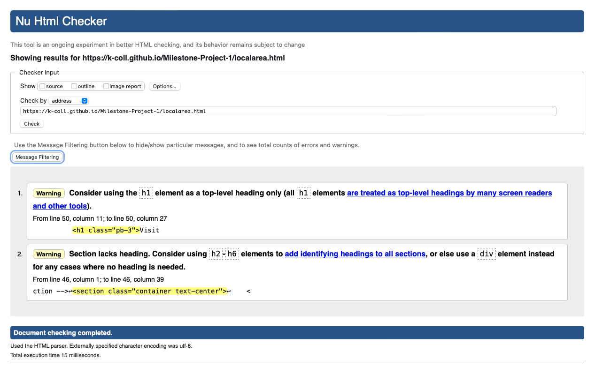
    

    

Contact

    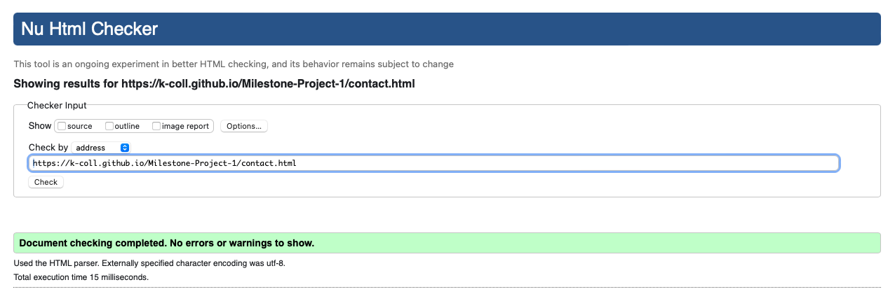
    

* #### CSS Validation
    The W3C Jigsaw CSS Validator was used to test the CSS code of the website. All CSS validation was successful. However, there was a warning regarding the use of Google Fonts, which could not be validated. This did not affect the validation of the CSS code as it still passed with no errors found.

    

CSS Validator

    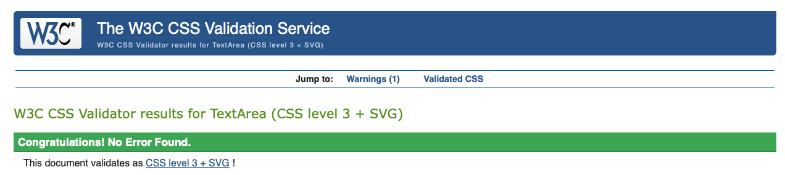
    

    

CSS Warning

    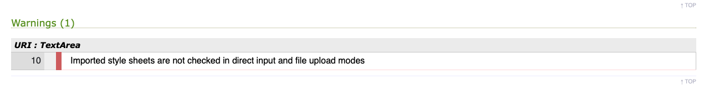
    

### Lighthouse
I tested my website using Lighthouse within Chrome Developer Tools. This allowed me to test for performance, accessibility, best practices and SEO (seacrh enginer optimisation). Initially, the performance score was the lowest at 85. This was due to the size of the images I was using, even though I had already compressed them down. I then converted the format of the images from jpg to webp format. This improved the performance quite a lot.

  
  

### Full Testing
  The website was tested and functioned / performed well on Chrome, Edge and Safari.  

  Full testing was carried out on the following devices:

  * Laptop
    * Macbook Pro, 14 inch 2021, M1 chip
    * Dell Latitude 7420

  * Tablet
    * iPad (7th generation)

  * Mobile
    * iPhone 11
    * Samsung Galaxy

### Links
The internal links feature in the menu navigation bar, as well as the footer – to link to the contact page. The external links feature in the footer for the social media links, as well as on the homepage in the general information section, to link to the marine conservation society. All internal links have been tested and take you to the directed page within the website. All external links have been tested and open in a new tab.

| Link / Feature                  |  Test Case                      | Outcome                                                                    |
| :---------                      | :----------------               | :-----------------------------------                                       |
| Oakwood Cove Campsite           | Click on Brand Name             | User is brought to the homepage                                            |
| Home link                       | Click on Home link              | User is brought to the home page                                           |
| Campsite link                   | Click on the Campsite link      | User is brought to the campsite page                                       |
| Local Area link                 | Click on the Local Area link    | User is brought to the local area page                                     |
| Contact link                    | Click on the Contact link       | User is brought to the contact page                                        |
| Find out more information link  | Click on the link / bolded text | User is taken to the marine conservation website, opens in a new tab       |
| Facebook icon                   | Click on the icon               | User is taken to the homepage of the Facebook website, opens in a new tab  |
| Twitter icon                    | Click on the icon               | User is taken to the homepage of the Twitter website, opens in a new tab   |
| Instagram icon                  | Click on the icon               | User is taken to the homepage of the Instagram website, opens in a new tab |
| Submit an Enquiry link          | Click on the link / bolded text | User is brought to the contact page                                        |   

### Contact Form
* To find the form, navigate to the ‘Contact’ page in the menu navigation bar, or by click on the ‘Submit an Enquiry’ link in the footer.  
* Fill out all the fields, including your first name, last name and a valid ‘@’ email address.  
* If the form is completed properly, you will see the following message:  
      
* If you try to submit without a first name or last name you will see the following message:  
      
* If you try to submit without a valid ‘@’ email address, you will see the following message:  
      
* If you try to submit a blank message without a description for your enquiry, you will see the following message:  
      

## Technologies Used

### Languages Used
* [HTML5](https://en.wikipedia.org/wiki/HTML5)
* [CSS3](https://en.wikipedia.org/wiki/CSS#CSS_3)
* [Bootstrap 5](https://getbootstrap.com/docs/5.0/getting-started/introduction/)
* [Markdown](https://en.wikipedia.org/wiki/Markdown)

### Applications Used
* Git was used for version control.  
* [Github](https://github.com/) was used to store the code.  
* [Gitpod](https://www.gitpod.io/) was used for the CI template and to access VS code.  
* [VS Code](https://code.visualstudio.com/)was used as a code editor.  
* [Balsamic](https://balsamiq.com/) was used to create Wireframes.  
* [Image Compressor](https://imagecompressor.com) was used to decrease the dimensions and size of the images used for the website.  
* [Convertio](https://convertio.co/) was used to convert the image file types from jpg to webp format.  
* [Am I Responsive](https://amiresponsive.co.uk/) was used to display all the pages of the website on different devices. 
* [W3C HTML Markup Validation](https://validator.w3.org) was used to validate the HTML code of the website.
* [W3C Jigsaw CSS Validation](https://jigsaw.w3.org/css-validator/) was used to validate the CSS code of the website.

### Frameworks, Libraries and CDNSs
* [Bootstrap 5](https://getbootstrap.com/docs/5.0/getting-started/introduction/) is used throughout the website for template code and responsiveness. This includes the Accordion, Navigation Bar, Card, Containers and Footer. All Bootstrap elements are styled using either Bootstrap CSS or custom CSS.  
* [Google Fonts](https://fonts.google.com/) was used to import the three fonts used into the website.  
* [Font Awesome](https://fontawesome.com/) was used to add icons for visual representation and aesthetic purposes.  

### VS Code Extensions
* [Prettier](https://prettier.io) – was used for code formatting and code completion. 
* [Live Server](https://marketplace.visualstudio.com/items?itemName=ritwickdey.LiveServer) – was used for live previewing the site during the build process. 

### Learning Resources and Credits
* [W3 Schools](https://www.w3schools.com) – used for problem solving.  
* [Stack Overflow](https://stackoverflow.com)– for troubleshooting issues and problem solving.  
* [Code Institute Slack Community](https://slack.com/intl/en-gb) – for problem solving and user feedback.  
* Code Institute Love Running Project – for inspiration / adaptation regarding the hero image text overlay.  
* Code Institute Whisky Drop Project – for inspiration and Bootstrap grid system.  
* Code Institue Rosie Resume – for inspiration and Bootstrap grid system.  
* [YouTube: Code used for Footer](https://www.youtube.com/watch?v=X3K5KCRYtRk) – adapted from and inspired by
* [How to make footer stay at bottom of page](https://radu.link/make-footer-stay-bottom-page-bootstrap) – code used.  
* [YouTube: Responsive image and text side by side using HTML and CSS](https://www.youtube.com/watch?v=-A_HESNP1T8) - Code used.
* [Article: Introducing Accessibility in Typography](https://fonts.google.com/knowledge/readability_and_accessibility/introducing_accessibility_in_typography).  
* [Article: Accessible Fonts](https://www.anphira.com/tutorial/accessible-fonts-select-website-font/).  
* [Article: Top 6 UI Fonts for Minimalist Interfaces](https://sparklin.medium.com/top-6-ui-fonts-for-minimalist-interfaces-in-2023-22c72f7620c2).  
* [Article: Typography](https://design.gccollab.ca/component/typography/).  

### Content Used and Credits
All text content was written by the developer and is fictional.  

## Deployment & Local Deployment
  * ### Deployment
    
    The live website was deployed to Github Pages, by following the below instructions:

    1. Log in (or sign up) to Github.
    2. Find the repository for this project, K-Coll/mp1-oakwood-cove-campsite
    3. Click on the Settings link.
    4. On the left hand side of the navigation bar, click on the Pages link.
    5. In the Source section, choose main from the drop down select branch menu. Select Root from the drop down select folder menu.
    6. Click Save. Your live Github Pages site is now deployed at the URL shown.

  * ### Local Deployment
    * ### How to Fork
      To fork the Oakwood Cover Campsite repository:

      1. Log in (or sign up) to Github.
      2. Go to the repository for this project, K-Coll/mp1-oakwood-cove-campsite.
      3. Click the Fork button in the top right corner.
  
    * ### How to Clone
      To clone the Oakwood Cove Campsite repository:

      1. Log in (or sign up) to GitHub.
      2. Go to the repository for this project, K-Coll/mp1-oakwood-cove-campsite.
      3. Click on the code button, select whether you would like to clone with HTTPS, SSH or GitHub CLI and copy the link shown.
      4. Open the terminal in your code editor and change the current working directory to the location you want to use for the cloned directory.
      5. Type 'git clone' into the terminal and then paste the link you copied in step 3. Press enter.

### Acknowledgements
* My mentor Mo Shami.  
* Code Institute Cohort Facilities Kristyna and cohort friends for their motivation and support, as well as our weekly meetings, which I look forward to attending.  
* The Code Institute Slack Community, both directly and indirectly. I was able to search the community and find help as well as ask directly in the various channels for specific issues. This is a supportive environment and community which helped me with problem solving.  
* My mum, family and friends for their support and encouragement.  
